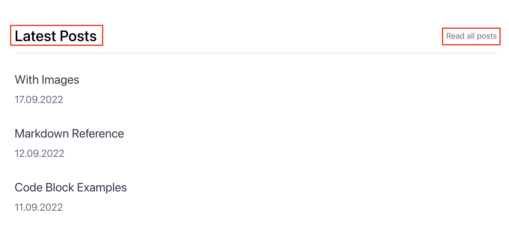
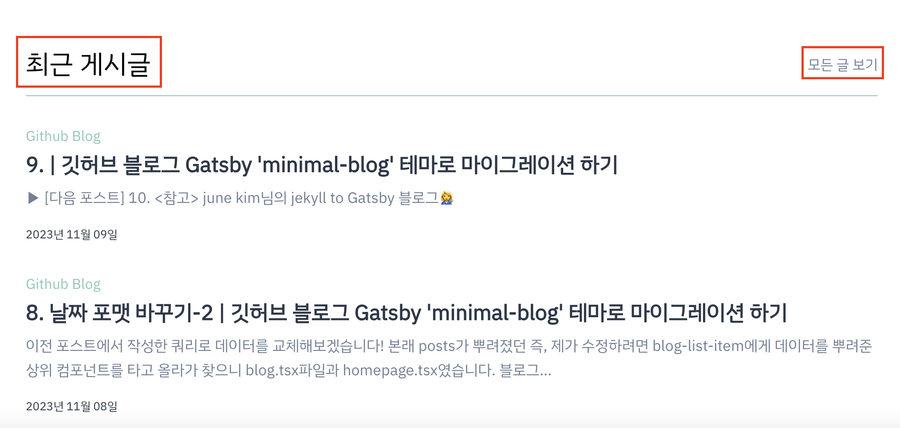

메인 페이지에 있는 'Latest Posts' 등의 부제목과 'View all tags' 등의 링크 이름을 바꿔보겠습니다.  
`src/@lekoarts/gatsby-theme-minimal-blog/components`의 `homepage.tsx`, `blog.tsx`, `tag.tsx` 파일 변경하고,  
 아래와 같은 방식으로 바꿔줬습니다.

<br />

```tsx title="src/@lekoarts/gatsby-theme-minimal-blog/components/homepage.tsx"
...
<Title text="최근 게시글">
	<Link to={replaceSlashes(`/${basePath}/${blogPath}`)}>모든 글 보기</Link>
</Title>
...
```



<br />

### <참고>

[LekoArts / gatsby-themes](https://github.com/LekoArts/gatsby-themes/tree/main/themes/gatsby-theme-minimal-blog)
