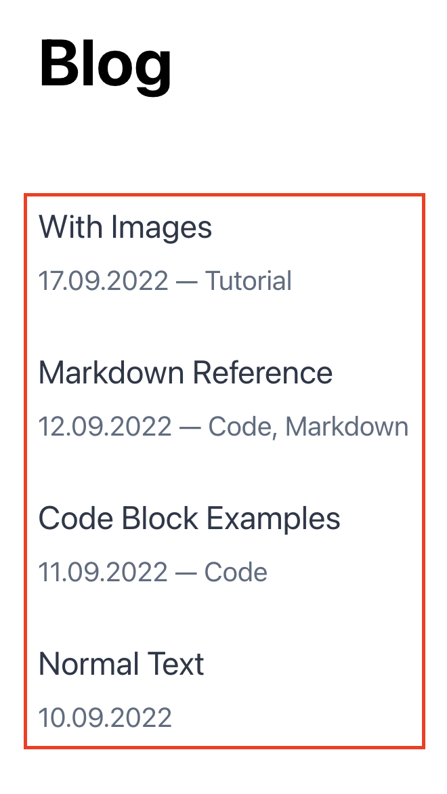
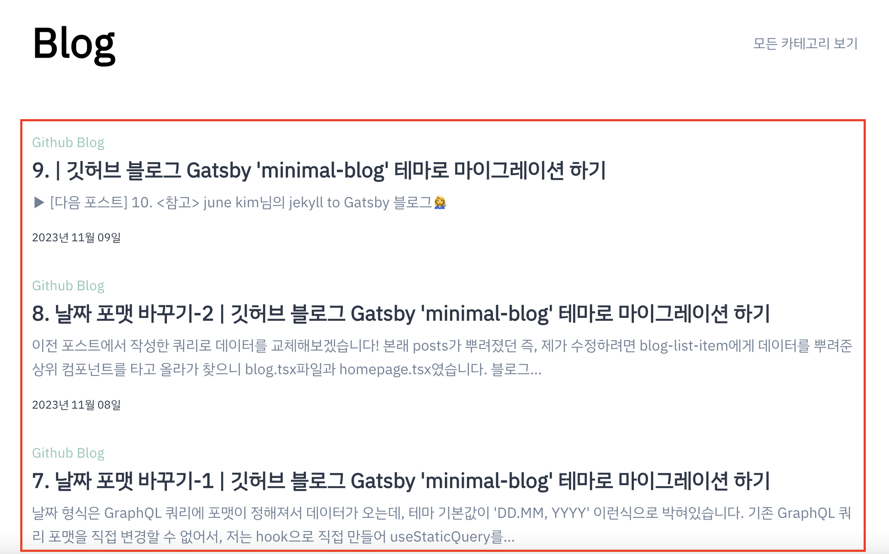

`src/@lekoarts/gatsby-theme-minimal-blog/components`의 `blog-list-item.tsx`이 블로그 게시글 리스트를 보여주는 컴포넌트 입니다.  
 `showTags = true`로 변경하여 태그들을 노출시키고 게시글 제목 위로 위치를 변경시킨 후,  
 GraphQL로 받아오는 data 중, `post.excerpt`가 게시글 내용의 일부를 노출시켜줍니다.

<br />

```tsx title="src/@lekoarts/gatsby-theme-minimal-blog/components/blog-list-item.tsx" highlight=3-4,6-10,14-15

 ...

 // showTags = true 변경
 const BlogListItem = ({ post, showTags = true }: BlogListItemProps) => (
     <Box mb={4}>
         {post.tags && showTags && (
             <div>
                 <ItemTags tags={post.tags} /> // 태그 노출 위치 변경
             </div>
         )}
         <Link to={post.slug} sx={(t) => ({ ...t.styles?.a, fontSize: [1, 2, 3], fontWeight: `semibold`, color: `text` })}>
             {post.title}
         </Link>
        // excerpt 추가
         <p sx={{ color: `secondary`, mt: 1, a: { color: `secondary` }, fontSize: 17 }}>{post.excerpt}</p>
         <p sx={{ fontSize: 13 }}>{post.date}</p>
     </Box>
 );

 export default BlogListItem;
```



<br/>

### \<참고>

[june kim님의 jekyll to Gatsby 블로그👩‍🔧](https://juneyr.dev/jekyll-to-gatsby-%EB%B8%94%EB%A1%9C%EA%B7%B8-%F0%9F%91%A9%E2%80%8D%F0%9F%94%A7)  
[LekoArts / gatsby-themes](https://github.com/LekoArts/gatsby-themes/tree/main/themes/gatsby-theme-minimal-blog)
