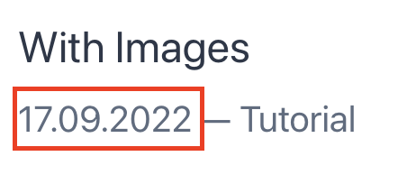

날짜 형식은 GraphQL 쿼리에 포맷이 정해져서 데이터가 오는데, 테마 기본값이 'DD.MM.YYYY' 이런식으로 박혀있습니다.  
기존 GraphQL 쿼리 포맷을 직접 변경할 수 없어서, 저는 hook으로 직접 만들어 [useStaticQuery](https://www.gatsbyjs.com/docs/how-to/querying-data/use-static-query/)를 이용하여 data를 교체해줬습니다.  
[june kim님의 jekyll to Gatsby 블로그👩‍🔧](https://juneyr.dev/jekyll-to-gatsby-%EB%B8%94%EB%A1%9C%EA%B7%B8-%F0%9F%91%A9%E2%80%8D%F0%9F%94%A7)이 글처럼 말이죠!

<br />

```tsx title="src/@lekoarts/gatsby-theme-minimal-blog/hooks/use-post.tsx"
import { graphql, useStaticQuery } from 'gatsby';

type Props = {
	posts: {
		slug: string;
		title: string;
		date: string;
		excerpt: string;
		description: string;
		tags?: {
			name: string;
			slug: string;
		}[];
	}[];
};

// 쿼리로 현재 존재하는 게시글들을 모두 가져와 줍니다.
// 이 쿼리를 확인해 보고 싶다면 `http://localhost:8000/___graphql` 에서 테스트 해볼 수 있습니다!
const usePosts = () => {
	const data = useStaticQuery<Props>(graphql`
        query {
            posts: allPost(sort: { date: DESC }) {
                nodes {
                    slug
                    title
                    date(formatString: "YYYY년 MM월 DD일") // 날짜 포맷을 바꿔줍니다.
                    excerpt
                    description
                    tags {
                        name
                        slug
                    }
                }
            }
        }
    `);

	return data.posts;
};

export default usePosts;
```

<br />

### \<참고>

[june kim님의 jekyll to Gatsby 블로그👩‍🔧](https://juneyr.dev/jekyll-to-gatsby-%EB%B8%94%EB%A1%9C%EA%B7%B8-%F0%9F%91%A9%E2%80%8D%F0%9F%94%A7)  
[LekoArts / gatsby-themes](https://github.com/LekoArts/gatsby-themes/tree/main/themes/gatsby-theme-minimal-blog)
