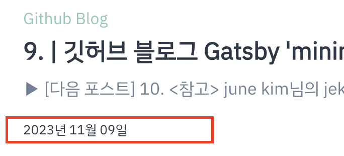

이전 포스트에서 작성한 쿼리로 데이터를 교체해보겠습니다!  
본래 posts가 뿌려졌던 즉, 제가 수정하려면 `blog-list-item`에게  
데이터를 뿌려준 상위 컴포넌트를 타고 올라가 찾으니 `blog.tsx`파일과 `homepage.tsx`였습니다.  
블로그 페이지 뿐만 아니라 메인 페이지에도 블로그 게시글 목록이 보이기 때문에 같은 방식으로 교체해줍니다.

<br />

```tsx title="src/@lekoarts/gatsby-theme-minimal-blog/components/Blog.tsx" highlight=3-4,6-7,22-23

...

// 본래 데이터인 { posts }: MBBlogProps 제거
const Blog = () => {
    const { tagsPath, basePath } = useMinimalBlogConfig();
    // hooks를 실행시켜 대체하기
    const posts = usePosts();

    return (
        <Layout>
            <Flex sx={{ alignItems: `center`, justifyContent: `space-between`, flexFlow: `wrap` }}>
                <Heading as="h1" variant="styles.h1" sx={{ marginY: 2 }}>
                    Blog
                </Heading>
                <Link
                    sx={(t) => ({ ...t.styles?.a, variant: `links.secondary`, marginY: 2 })}
                    to={replaceSlashes(`/${basePath}/${tagsPath}`)}
                >
                    모든 카테고리 보기
                </Link>
            </Flex>
            // Listing > blog-list-item! 내려줄 때는 posts.nodes로 내려주어야 합니다.
            <Listing posts={posts.nodes} sx={{ mt: [4, 5] }} />
        </Layout>
    );
};

export default Blog;
```



<br />

### <참고>

[june kim님의 jekyll to Gatsby 블로그👩‍🔧](https://juneyr.dev/jekyll-to-gatsby-%EB%B8%94%EB%A1%9C%EA%B7%B8-%F0%9F%91%A9%E2%80%8D%F0%9F%94%A7)
