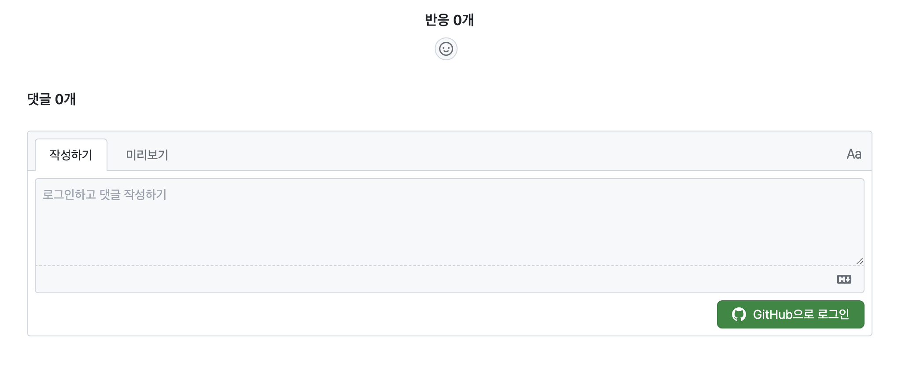
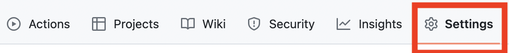
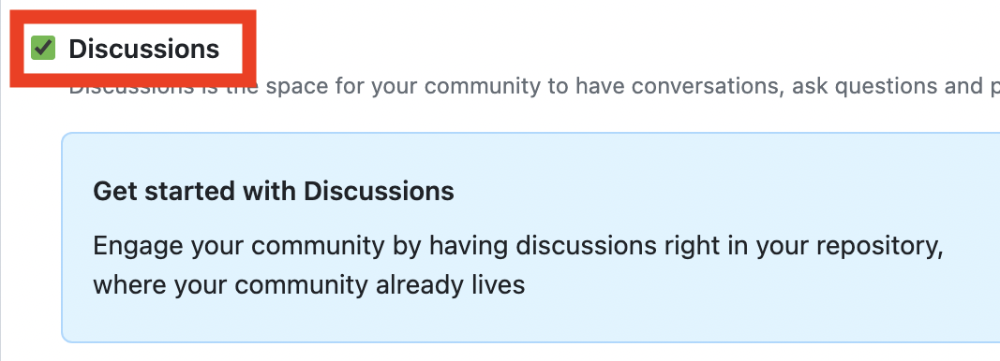
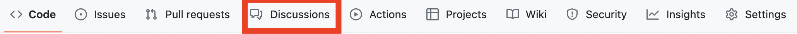
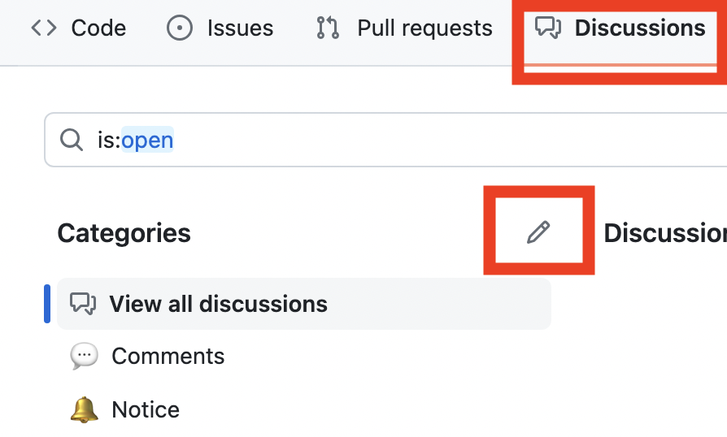
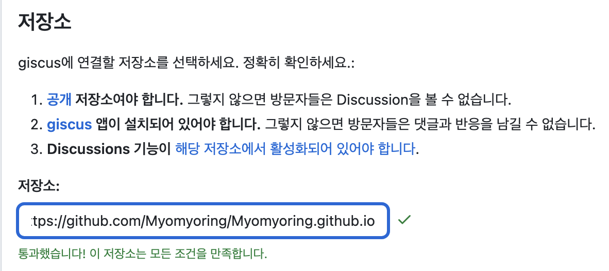
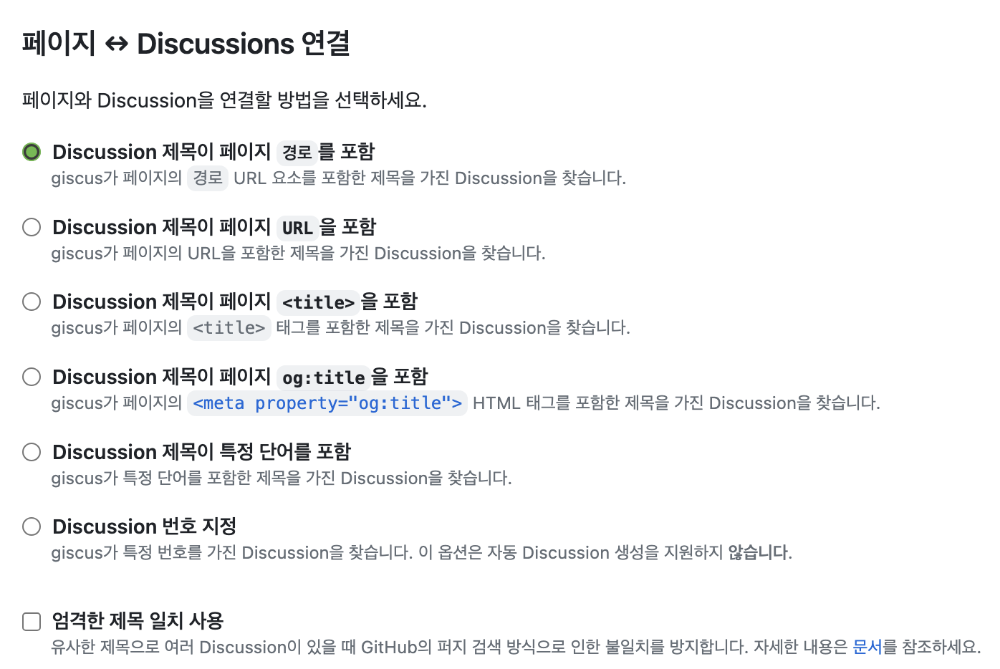
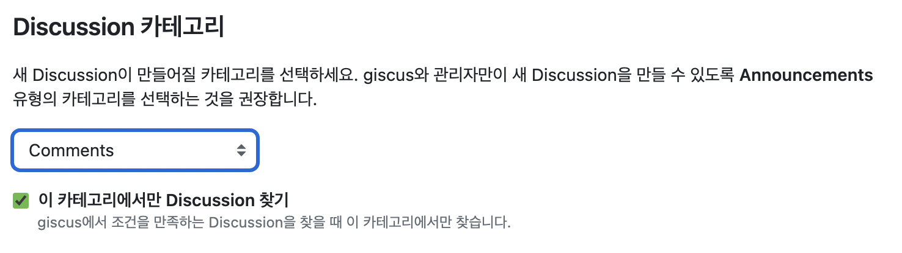
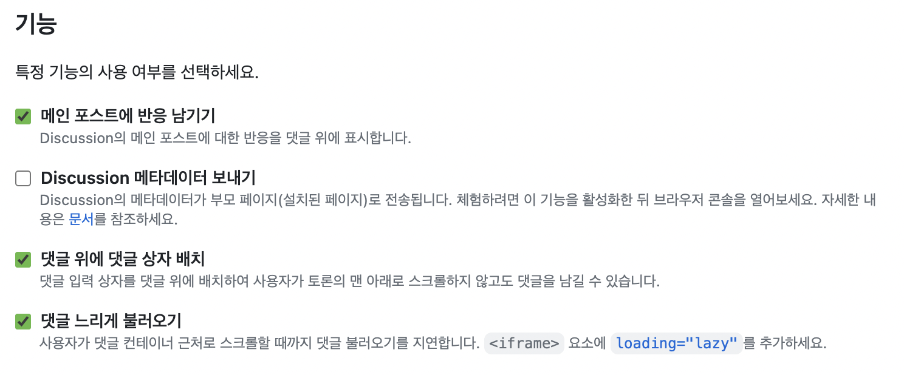
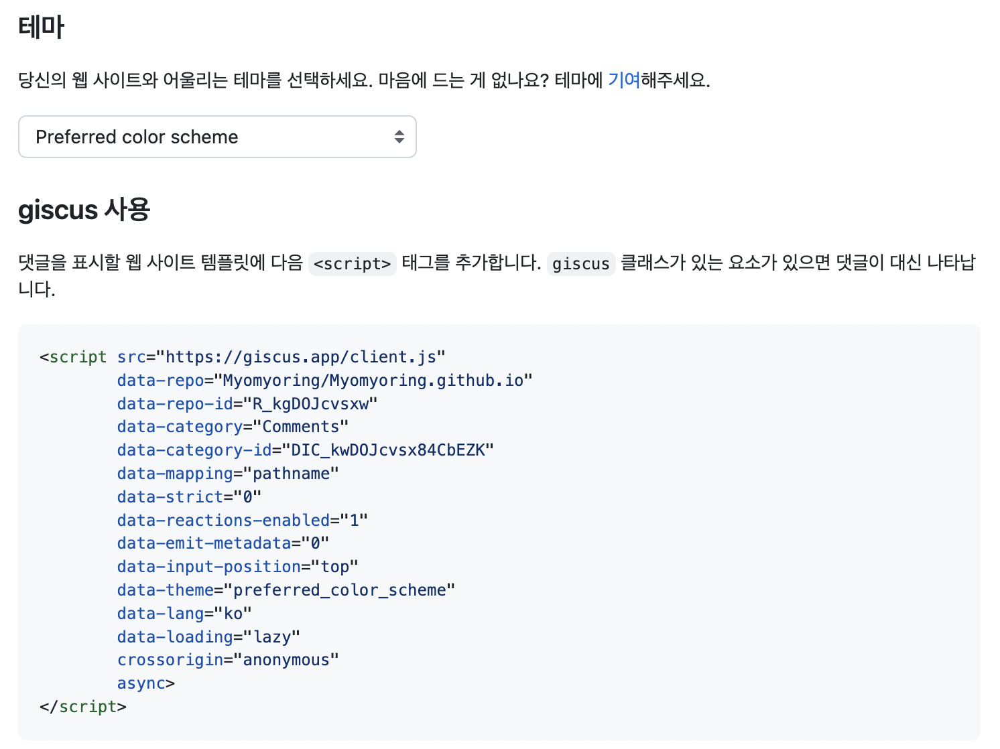

이전 Jekyll로 블로그를 만들었을 땐 [utterances](https://utteranc.es/)를 설치해서 댓글 기능을 추가했었습니다.  
근래 다른 블로그를 방문하다보니까 위처럼 한글 버전이 있는게 아니겠어요!  
그게 바로 [giscus](https://giscus.app/ko)였습니다.

Github의 Repository에 댓글을 저장하여 API로 불러와서 사용합니다.

<br />

1. 댓글 issue가 담길 레포를 정한 후 [giscus](https://github.com/apps/giscus)를 install 하여 활성화 해줍니다! 저는 블로그와 같은 레포로 정했어요.
2. 레포의 settings로 들어갑니다.
   
3. General의 Discussions을 체크해줍니다.
   
4. 레포 내비게이션에 Discussions이 생성된 것을 확인할 수 있는데요, 클릭해줍니다!
   
5. 왼쪽 Categories의 펜 아이콘을 눌러 수정해줍니다! 저는 기본으로 있던 것들을 제거하고, 댓글을 담을 Comments와 공지를 담을 Notice를 만들었습니다.
   
6. 바로 [giscus](https://giscus.app/ko) 여기를 들어가 설정해줄 수 있습니다. 해당 방법은 script 태그를 추가하고, giscus 클래스가 있는 요소가 있으면 댓글이 대신 나타납니다.
7. 저는 [giscus-component](https://github.com/giscus/giscus-component)을 이용하여 컴포넌트 형태로 추가했습니다.
8. [giscus](https://giscus.app/ko) 여기로 다시 들어가서 설정해봅시다!
9. 저장소에 댓글 레포의 주소를 넣어줍니다.
   
10. 페이지 ↔️ Discussions 연결에서 원하는 설정을 선택합니다.
    
11. Discussion 카테고리에서 아까 만든 Categories를 설정해줍니다.
    
12. 기능에서 원하는 설정을 해줍니다.
    
13. 원하는 테마를 선택하면 script 태그가 생성됩니다! 이대로 추가해도 되지만, 저는 이것을 컴포넌트 형식으로 바꾸겠습니다.
    
14. giscus-component를 프로젝트에 먼저 설치해줍니다!

    ```
    npm i @giscus/react
    yarn add @giscus/react

    ```

15. script태그에 있는 내용으로 Giscus 컴포넌트에 데이터를 작성하겠습니다. `data-*` 형태의 속성을 data를 떼고, 카멜 케이스로 작성하는 방식입니다.

    ```js
    <script
    	src="https://giscus.app/client.js"
    	data-repo="Myomyoring/Myomyoring.github.io"
    	data-repo-id="R_kgDOJcvsxw"
    	data-category="Comments"
    	data-category-id="DIC_kwDOJcvsx84CbEZK"
    	data-mapping="pathname"
    	data-strict="0"
    	data-reactions-enabled="1"
    	data-emit-metadata="0"
    	data-input-position="top"
    	data-theme="preferred_color_scheme"
    	data-lang="ko"
    	data-loading="lazy"
    	crossorigin="anonymous"
    	async
    ></script>;

    import Giscus from '@giscus/react';

    <Giscus
    	id="comments"
    	repo="Myomyoring/Myomyoring.github.io"
    	repoId="R_kgDOJcvsxw"
    	category="Comments"
    	categoryId="DIC_kwDOJcvsx84CbEZK"
    	mapping="pathname"
    	term="Welcome to @giscus/react component!"
    	reactionsEnabled="1"
    	emitMetadata="0"
    	inputPosition="top"
    	theme="preferred_color_scheme"
    	lang="ko"
    	loading="lazy"
    />;
    ```

16. 댓글 기능을 달 컴포넌트에 위에서 작성한 Giscus 컴포넌트를 추가해줍니다! 저는 `post.tsx` 컴포넌트 Footer 아래에 추가해줬습니다.

    ```tsx title="src/@lekoarts/gatsby-theme-minimal-blog/component/post.tsx"

    ...

    import Giscus from '@giscus/react';

    ...

            <PostFooter post={post} />
            <Giscus
            id="comments"
            repo="Myomyoring/Myomyoring.github.io"
            repoId="R_kgDOJcvsxw"
            category="Comments"
            categoryId="DIC_kwDOJcvsx84CbEZK"
            mapping="pathname"
            term="Welcome to @giscus/react component!"
            reactionsEnabled="1"
            emitMetadata="0"
            inputPosition="top"
            theme="preferred_color_scheme"
            lang="ko"
            loading="lazy"
            />

    ...

    ```

<br/>

### <참고>

[utterances](https://utteranc.es/)  
[giscus](https://giscus.app/ko)  
[giscus-component](https://github.com/giscus/giscus-component)  
[기술 블로그에 Giscus를 추가했습니다!](https://univdev.page/posts/add-giscus/)
