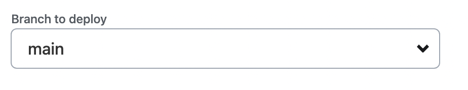
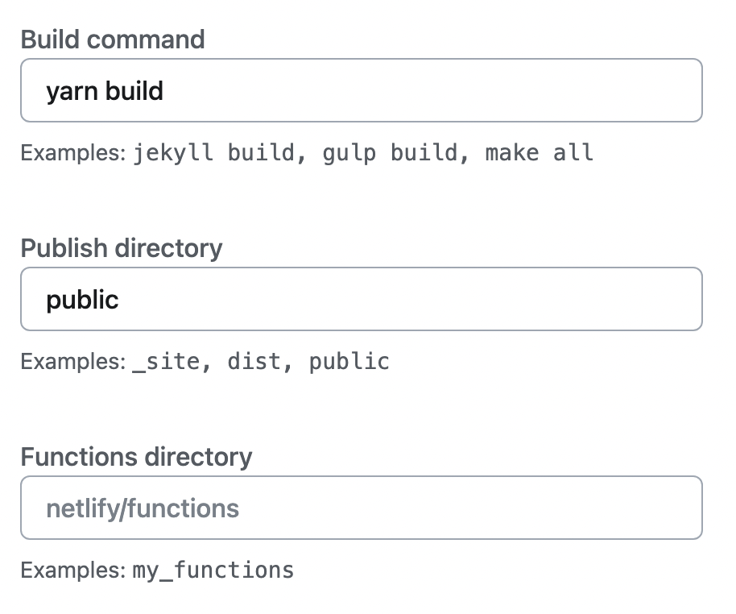

이제 Gatsby가 권장하는 방법인 Netlify로 배포해보겠습니다!  
저는 게시물을 하나도 작성안하고 배포하려 했더니 에러가 났었어요. <u>꼭 하나 이상의 게시물을 작성한 채로 배포를 진행</u>하시기 바랍니다.  
Netlify 배포는 굉장히 간단합니다.

1. [Netlify](https://www.netlify.com/)에 접속하여 계정이 없으신 분들은 가입해줍니다.
2. 가입하면서 자연스럽게 절차가 첫 프로젝트를 배포하라는 가이드로 이어집니다.
3. Deploy with Github에서 블로그 레포를 선택합니다.
4. Configure site and deploy에서 설정을 해줍니다.
   
   
5. 5-10분 내외로 Netlify가 빌드를 진행하고 배포를 해줍니다.
6. 배포에 성공한 후에 레포에 업데이트를 푸쉬하면 1-2분 내외로 반영됩니다.

 

참 간단하죠?!

 

### \<참고>

[Gatsby on Netlify](https://docs.netlify.com/integrations/frameworks/gatsby/?gatsby-version=adapters)  
[Gatsby Cloud에서 Netlify로 배포 플랫폼 변경하기](https://heyjihye.com/blog/deploy-to-netlify-from-gatsby-cloud/)
