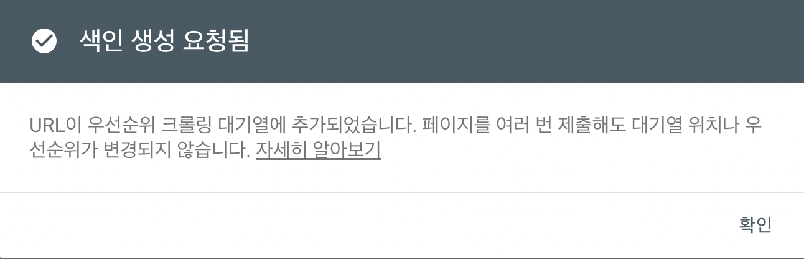
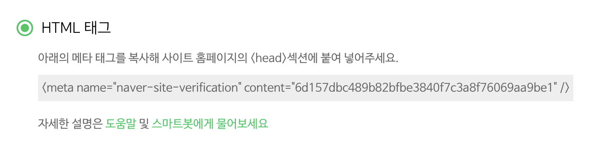

이제 포털 사이트에 내 블로그를 등록해보겠습니다.  
유입은 Google > Bing > Naver > Daum 순으로 많다고 합니다!  
진행할 순서는 아래와 같습니다.

1. Google Search Console
2. Google Analytics
3. 네이버 웹 마스터
4. Bing 웹 마스터
5. Daum 검색등록

<br />

# Google Search Console

Google Search Console은 구글 검색 엔진에 웹사이트가 검색되도록 등록해주고, 구글 검색 결과가 어떻게 이뤄지고 있는지 모니터링 결과도 알려줍니다.

1. [Google Search Console](https://search.google.com/search-console/about)에 접속하여 시작하기를 눌러주세요.
   

2. URL 접두어에 배포한 url을 입력해주세요.
   
3. html 어쩌구 나오는데, 아래로 내려보면 HTML 메타 태그를 추가하여 인증하는 방식이 가장 간단합니다. 해당 메타 태그를 복사해줍니다.
   
4. 복사한 메타 태그를 `src/@lekoarts/gatsby-theme-minimal-blog/component`의 `seo.tsx`파일에 붙여넣어줍니다.

   ```tsx title="src/@lekoarts/gatsby-theme-minimal-blog/component/seo.tsx" highlight=7

   ...

               <meta name="twitter:image" content={seo.image} />
               <meta name="twitter:image:alt" content={seo.description} />
               <meta name="twitter:creator" content={author} />
               <meta name="gatsby-theme" content="@lekoarts/gatsby-theme-minimal-blog" />
               <meta name="google-site-verification" content="OppuUSQ9vC88LMBtY4B5w74bH7TRqdfXn4RJ8KdE3Ck" />
               <link rel="icon" type="image/png" sizes="32x32" href={withPrefix(`/favicon-32x32.png`)} />
               <link rel="icon" type="image/png" sizes="16x16" href={withPrefix(`/favicon-16x16.png`)} />

   ...

   ```

5. 변경사항을 push한 후, 몇 분후에 인증이 완료됩니다.
6. 생성한 sitemap과 rss를 등록하겠습니다. 왼쪽 사이드바에서 `Sitemaps`를 눌러주세요!
   
7. Jekyll로 배포하고 등록했을 땐 분명히 됐는데 이 테마는 어째서인지 등록이 되지 않네요. 수동으로 요청을 넣어보겠습니다. (url에서도 뜨는데 말이죠..)  
   
8. 사이드바에서 `URL 검사`를 누르고, url 입력, 실제 URL 테스트, 색인 요청 순서대로 눌러주세요.  
   색인 요청 횟수가 정해져 있어서 초과하면 다음 날 진행해야 해요!
   
   
   
9. 위 방법으로 sitemap과 rss를 요청을 해주시면 됩니다.

<br />

# Google Analytics

Google Analytics는 웹분석 도구로 구글 검색 엔진과는 별개로 사람들이 본인의 웹사이트를 어떻게 사용하는지 효과적으로 파악할 수 있게 해줍니다.

1. [Google Analytics](https://analytics.google.com/)에 접속합니다. 저는 예전에 등록했어서 계정이 있습니다. 사이드바 하단에 설정을 눌러주세요.
   
2. 아이콘 아래 만들기를 누르고 `속성`을 눌러줍니다.
   
3. 속성을 만들겠습니다. 설정에 맞게 진행합니다
   
   
   
4. 설정을 다 해주셨으면 `웹`을 눌러주세요.
   
5. 스트림을 만들겠습니다!
   
6. `측정 ID`를 프로젝트에 설정에 주겠습니다.
   
7. 이 부분은 [gatsby-plugin-google-gtag](https://www.gatsbyjs.com/plugins/gatsby-plugin-google-gtag/)가 필요합니다 설치해주세요!
   ```
   npm install gatsby-plugin-google-gtag
   yarn add gatsby-plugin-google-gtag
   ```
8. `gatsby-config.ts`의 `plugins: []` 배열에 다음과 같이 추가한 후 애널리틱스에서 확인해주세요.

   ```ts title="gatsby-config.ts"
           {
               resolve: `gatsby-plugin-google-gtag`,
               options: {
                   trackingIds: [`G-WX06Y8S5VC`], // 측정 ID
               },
           },
   ```

<br />

# 네이버 웹 마스터

1. [Naver Search Advisor](https://searchadvisor.naver.com/)에 접속합니다.
2. 네이버 로그인 후, 오른쪽 상단에 `웹마스터 도구`를 클릭해주세요.
   
3. 내 배포 url을 입력해주세요!
   
4. Google Search Console 때와 마찬가지로, html 메타 태그 방식으로 진행합니다!
   
5. 똑같이 복사한 메타 태그를 `src/@lekoarts/gatsby-theme-minimal-blog/component`의 `seo.tsx`파일에 붙여 넣어줍니다.

   ```tsx title="src/@lekoarts/gatsby-theme-minimal-blog/component/seo.tsx" highlight=7

   ...

               <meta name="twitter:image" content={seo.image} />
               <meta name="twitter:image:alt" content={seo.description} />
               <meta name="twitter:creator" content={author} />
               <meta name="gatsby-theme" content="@lekoarts/gatsby-theme-minimal-blog" />
               <meta name="naver-site-verification" content="6d157dbc489b82bfbe3840f7c3a8f76069aa9be1" />
               <link rel="icon" type="image/png" sizes="32x32" href={withPrefix(`/favicon-32x32.png`)} />
               <link rel="icon" type="image/png" sizes="16x16" href={withPrefix(`/favicon-16x16.png`)} />

   ...

   ```

6. `sitemap.xml`을 제출하면 끝!

<br />

# Bing 웹 마스터

1. [Bing 웹마스터](https://www.bing.com/webmasters)에 접속해주세요!
2. 저는 이미 등록해놨는데요, `사이트 추가` 버튼을 눌러 추가할 수 있습니다.
   
3. Bing 웹 마스터 등록은 Google Search Console에 등록이 되어있으면 아주 간단하게 등록이 가능합니다. `가져오기`를 눌러주세요!
   

# Daum 검색등록

1. [Daum 검색등록](https://register.search.daum.net/index.daum)에 접속해주세요!
2. 블로그 등록을 선택하고 배포 url을 입력해주세요. (http://가 지워지지 않아서 그냥 넣었는데 됐습니다.)
   
3. 약관에 동의한 후, 이메일을 입력해주세요.
   
4. 등록신청 완료!
   

<br />

---

<br />
블로그 마이그레이션 여정이 모두 완료되었습니다. 추가로 구글 애드센스 등 광고를 붙이거나, 커스텀 도메인을 변경하는 등 절차를
진행하실 수 있습니다. 저는 광고 UI가 지저분하다고 느껴서 아직 붙일 생각 없네용! 멋진 블로그를 완성하시길 바랍니다. 모두 고생하셨습니다
!

<br />

---

### <참고>

[하우투: 같이 따라하기 시리즈](https://devinlife.com/howto/)  
[블로그를 Google Analytics에 추가](https://ha-young.github.io/2020/gatsby/Add-Google-Analytics/)
