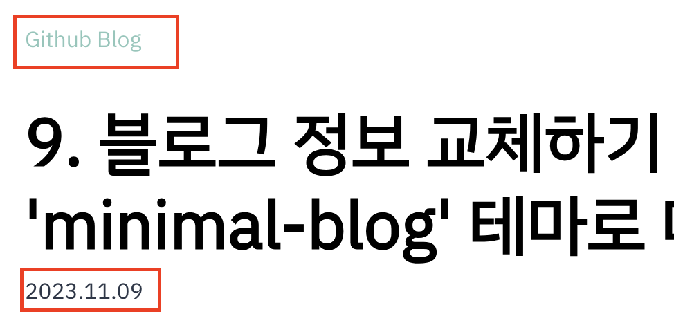

### 타이틀 구성 변경하기


게시글 상세페이지의 타이틀 부분의 구성을 변경해봅시다!  
`src/@lekoarts/gatsby-theme-minimal-blog/components` 의 `post.tsx`에서 변경할 수 있습니다.  
저는 <u>태그 노출 위치</u>와 <u>날짜 포맷을 변경</u>하고 <u>제목 외에는 삭제</u>했습니다.

`날짜 포맷`의 경우, 저번 포스팅처럼 게시글 상세페이지는 <u>상위 컴포넌트에서 내려주는 페이지가 아니라고 판단</u>되어서 직접 바꿔주었습니다.  
뒤져보았지만 저는 못 찾았습니당... 대신 `년월일`을 적용하지 않고 순서만 뒤집어서 `YYYY.MM.DD`형식으로 변경했습니다.   
문자열로 내려오는 날짜값인 post.date를 [split()](https://developer.mozilla.org/ko/docs/Web/JavaScript/Reference/Global_Objects/String/split) 함수를 이용하여 '.' 구분자로 나눈 후, [reverse()](https://developer.mozilla.org/ko/docs/Web/JavaScript/Reference/Global_Objects/Array/reverse) 함수로 순서를 반전시킵니다.   
배열이 된 데이터를 [join()](https://developer.mozilla.org/ko/docs/Web/JavaScript/Reference/Global_Objects/Array/join) 함수의 '.' 구분자를 이용하여 다시 문자열로 바꿔줬습니다.   

<br />

```tsx title="src/@lekoarts/gatsby-theme-minimal-blog/components/post.tsx" highlight=2-7,12

...
        // 태그 노출 위치 변경
		{post.tags && (
			<span>
				<ItemTags tags={post.tags} />
			</span>
		)}
		<Heading as="h1" variant="styles.h1">
			{post.title}
		</Heading>
		<span sx={{ mt: 2, a: { color: `secondary` }, fontSize: [1, 1, 1] }}>
			<time>{`${post.date.split('.').reverse().join('.')}`}</time> // date 포맷 직접 변경
		</span>

...

```



---

### 하이라이트 변경하기


하이라이트의 색상은 [4. 메인 컬러 변경하기](/gatsby-blog-migration-4) 파트에서 변경했습니다.  
외곽 둥글기(?)를 넣어주려고 합니다.  
`src/@lekoarts/gatsby-theme-minimal-blog/styles`의 `code.ts`에서 변경할 수 있습니다.

<br />

```ts title="src/@lekoarts/gatsby-theme-minimal-blog/styles/code.ts" highlight=8

...

	'p > code, li > code': {
		bg: `muted`,
		color: `heading`,
		px: 2,
		py: 1,
		borderRadius: `13px`, // 요리 조리 변경해보며 입맛에 맞게 변경해줍니다.
		fontSize: 13,
	},

...

```


---

▶️ [[다음 포스트] 11. 코드 블럭 폰트 사이즈 변경하기 ](/gatsby-blog-migration-11)

---
