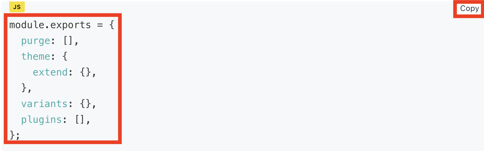

코드 블럭 폰트 크기가 너무 커보여서 작게 변경해보겠습니다!  
저번 하이라이트 변경했던 파일인 `src/@lekoarts/gatsby-theme-minimal-blog/styles` 의 `code.ts`에서 할 수 있습니다.  
컬러 등도 이 파일에서 가능합니다.

<br />

```ts title="src/@lekoarts/gatsby-theme-minimal-blog/styles/code.ts" highlight=4

...

	'.prism-code': {
		fontSize: 13, // 원하는 사이즈로 변경
		webkitOverflowScrolling: `touch`,
		backgroundColor: `transparent`,
		minWidth: `100%`,
		mb: 0,
		mt: 0,
		overflow: `auto`,
		'&[data-linenumber="false"]': {
			'.token-line': {
				pl: 3,
			},
		},
	},

...

```

<br />

이어서 copy 버튼 폰트 사이즈를 변경하겠습니다.  
`src/gatsby-plugin-theme-ui`의 `index.ts`에서 변경할 수 있습니다!

<br />

```ts title="src/gatsby-plugin-theme-ui/index.ts" highlight=6

	copyButton: {
		backgroundColor: `background`,
		border: `none`,
		color: `text`,
		cursor: `pointer`,
		fontSize: [`11px`, `11px`, `13px`], // 순서대로 모바일, 태블릿, 데스크탑 순서입니다.
		fontFamily: `body`,
		letterSpacing: `0.025rem`,
		transition: `all 0.3s ease-in-out`,
		'&[disabled]': {
			cursor: `not-allowed`,
		},


```


---

▶️ [[다음 포스트] 12. 웹 폰트 적용하기 ](/gatsby-blog-migration-12)

---
