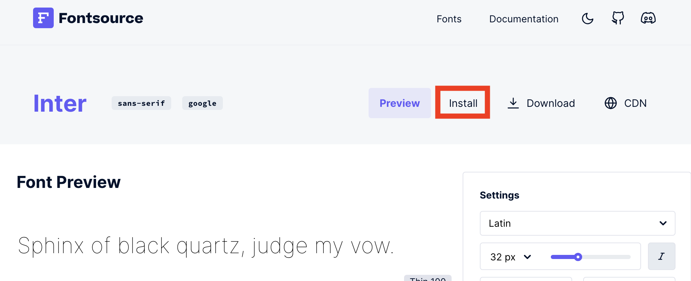
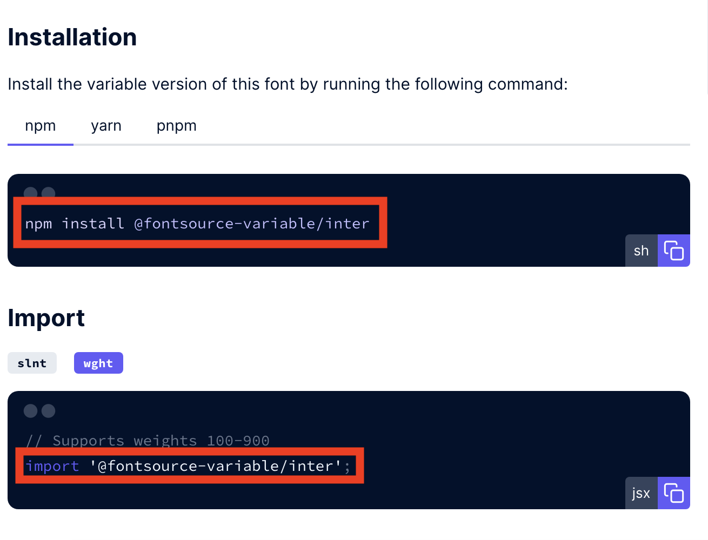

딱딱한 기존 폰트를 변경하겠습니다.  
[Using Web Fonts](https://www.gatsbyjs.com/docs/how-to/styling/using-web-fonts/#self-host-google-fonts-with-fontsource) 공식문서 중간 쯤에 _Self-host Google Fonts with Fontsource_ 파트를 참고해주세요!

1. [NPM](https://www.npmjs.com/search?q=fontsource) 또는 [Fontsource Font Preview](https://fontsource.org/)중 원하는 폰트를 골라주세요!
2. 저는 Fontsource에서 선택을 해서 여기 기준으로 진행하겠습니다. 고른 폰트 페이지의 오른쪽 상단 `install`을 눌러주세요.
   
3. 폰트에 해당되는 명령어가 나옵니다! 설치해주세요.

   ```
   npm install @fontsource/폰트명
   yarn add @fontsource/폰트명

   ```

   

4. `src/gatsby-plugin-theme-ui`의 `index.ts` 파일에 install 페이지에 같이 작성되었던 import 명령어를 넣어주세요.

   ```ts title="src/gatsby-plugin-theme-ui/index.ts" highlight=4
   import { merge, ThemeUIStyleObject } from 'theme-ui';
   import tailwind from '@theme-ui/preset-tailwind';
   import { lightThemeVars, darkThemeVars } from '../utils/prism-themes';
   import '@fontsource-variable/inter'; // import 해줍니다.

   ...

   ```

5. 같은 파일 하단으로 내려 `fonts` 객체에 폰트명을 추가해줍니다.

   ```ts title="src/gatsby-plugin-theme-ui/index.ts" highlight=4
   ...

   fonts: { // 폰트명 추가
   	body: `'inter', -apple-system, BlinkMacSystemFont,"Segoe UI",Roboto,"Helvetica Neue",Arial,"Noto Sans",sans-serif,"Apple Color Emoji","Segoe UI Emoji","Segoe UI Symbol","Noto Color Emoji"`,
   },

   ...

   ```

6. 다시 하단으로 내려 `styles` 객체 중 pre 객체의 `fontFamily` 폰트명을 변경해줍니다.

   ```ts title="src/gatsby-plugin-theme-ui/index.ts" highlight=18

   ...

   styles: {
          root: {
              color: `text`,
              backgroundColor: `background`,
              margin: 0,
              padding: 0,
              boxSizing: `border-box`,
              textRendering: `optimizeLegibility`,
              WebkitFontSmoothing: `antialiased`,
              MozOsxFontSmoothing: `grayscale`,
              WebkitTextSizeAdjust: `100%`,
              img: {
                  borderStyle: `none`,
              },
              pre: {
                  fontFamily: `inter`, // 폰트명 변경
                  fontSize: `1em`,
              },

    ...

   ```

7. 웹 폰트 추가 완료!

<br />

---

▶️ [[다음 포스트] 13. sitemap, rss, robots 적용하기 ](/gatsby-blog-migration-13)

---

### \<참고>

[Using Web Fonts](https://www.gatsbyjs.com/docs/how-to/styling/using-web-fonts/#self-host-google-fonts-with-fontsource)   
[Gatsby로 블로그 만들기 - (4) 폰트 바꾸기](<https://0andme.github.io/blog/gatsby%EB%A1%9C-%EB%B8%94%EB%A1%9C%EA%B7%B8-%EB%A7%8C%EB%93%A4%EA%B8%B0-(4)-%ED%8F%B0%ED%8A%B8-%EB%B0%94%EA%BE%B8%EA%B8%B0/>)
