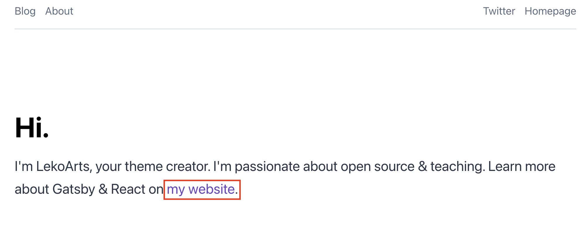
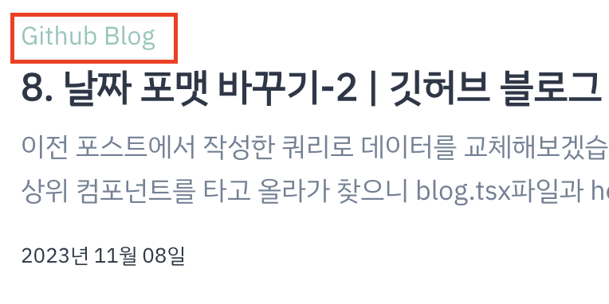

기존의 보라색 메인 컬러를 바꿔보겠습니다.  
`src/gatsby-plugin-theme-ui` 안에 있는 `index.ts` 파일로 블로그 색상이나 폰트 크기 등 입맛대로 변경할 수 있습니다.

<u>utils 폴더를 의존</u>하고 있으며, 저는 이것저것 만지면서 메인 컬러와 이외에 변경하고 싶은 항목을 아래와 같이
변경해줬습니다.

<br />

```ts title="src/gatsby-plugin-theme-ui/index.ts" highlight=5

...

// 라이트 모드
colors: {
	primary: `#8cc7bb`, // 여기가 메인 컬러
	secondary: tailwind.colors.gray[6], // 세컨 컬러
	toggleIcon: `#8cc7bb`,
	heading: tailwind.colors.black,
	divide: `#8cc7bb`,
	muted: `#8cc7bb`,
	highlightLineBg: `rgba(0, 0, 0, 0.035)`,
	...lightThemeVars,
	modes: {
		dark: { // 다크 모드
			text: tailwind.colors.gray[4],
			primary: `#8cc7bb`,
			secondary: tailwind.colors.gray[6],
			toggleIcon: `#8cc7bb`,
			background: tailwind.colors.gray[8],
			heading: tailwind.colors.white,
			divide: `#8cc7bb`,
			muted: tailwind.colors.gray[7],
			highlightLineBg: `rgba(255, 255, 255, 0.1)`,
			...darkThemeVars,
		},
	},
},

...

```



<br />

---

▶️ [[다음 포스트] 5. 메인 페이지 부제목, 링크 Text 변경하기](/gatsby-blog-migration-5)

---

### \<참고>

[june kim님의 jekyll to Gatsby 블로그👩‍🔧](https://juneyr.dev/jekyll-to-gatsby-%EB%B8%94%EB%A1%9C%EA%B7%B8-%F0%9F%91%A9%E2%80%8D%F0%9F%94%A7)
[LekoArts / gatsby-themes](https://github.com/LekoArts/gatsby-themes/tree/main/themes/gatsby-theme-minimal-blog)
