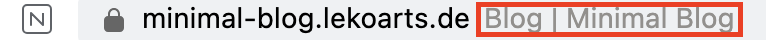
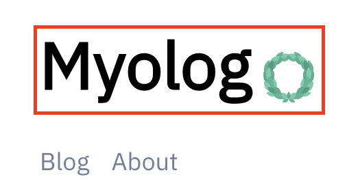
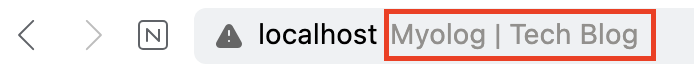
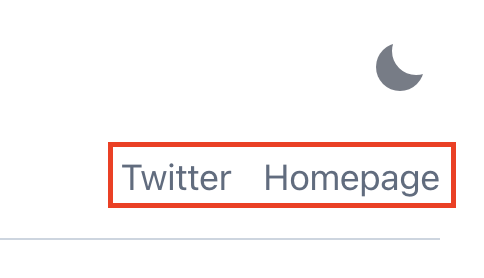
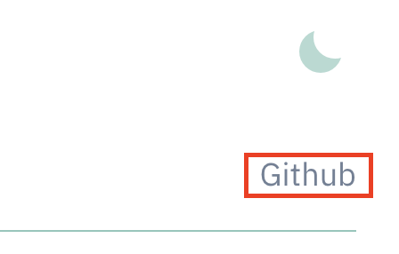

우선 `블로그의 제목과 소개`를 먼저 바꿔볼텐데요,  
이러한 설정은 거의 루트 디렉토리에 위치해 있는 `gatsby-config.ts`에서 가능합니다.  
저는 아래와 같이 변경해줬습니다.

<br />

```ts title="gatsby-config.ts"
...

const config: GatsbyConfig = {
	siteMetadata: {
		siteTitle: `Myolog`, // 블로그 타이틀 제목
		siteTitleAlt: `Myolog | Tech Blog` // 브라우저 타이틀, 주소창 등에 띄워질 Head (Seo),
		siteHeadline: `Myolog | Tech Blog`,
		siteUrl: `https://myomyoring.netlify.app`,
		siteDescription: `프론트엔드 개발자 취준생 기술 블로그`,
		siteImage: `/banner.jpg`,
		siteLanguage: `ko`,
		author: `@Myomyoring`,
	}
}

...

```




---



다음은 `externalLinks` 를 변경해보겠습니다. 마찬가지로 `gatsby-config.ts`에서 변경합니다.

<br />

```ts title="gatsby-config.ts" highlight=16-20
...

{
			resolve: `@lekoarts/gatsby-theme-minimal-blog`,
			options: {
				navigation: [
					{
						title: `Blog`,
						slug: `/blog`,
					},
					{
						title: `About`,
						slug: `/about`,
					},
				],
				externalLinks: [ // 이 배열에서 추가, 수정, 제거 해주시면 됩니다
					{
						name: `Github`,
						url: `https://github.com/Myomyoring`,
					},
				],
			},
		},

...

```



---

▶️ [[다음 포스트] 10. 게시글 상세페이지 날짜 포맷, 하이라이트 변경하기](/gatsby-blog-migration-10)

---
